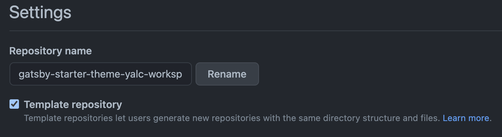
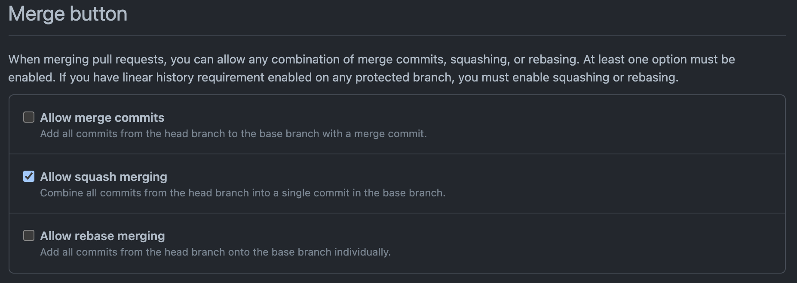

<p align="center">
  <a href="https://www.gatsbyjs.com/">
    
  </a>
</p>
<h1 align="center">
  Starter for creating a Gatsby Theme workspace using Yalc.
</h1>

<p align="center">
  <a href="https://github.com/DanailMinchev/gatsby-starter-theme-yalc-workspace/blob/master/LICENSE">
    
  </a>
  <a href="https://github.com/DanailMinchev/gatsby-starter-theme-yalc-workspace/blob/master/CONTRIBUTING.md">
    
  </a>
  <br />
  <a href="https://github.com/DanailMinchev/gatsby-starter-theme-yalc-workspace/actions">
    
  </a>
  <a href="https://codecov.io/gh/DanailMinchev/gatsby-starter-theme-yalc-workspace">
    
  </a>
  <br />
  <a href="https://github.com/prettier/prettier">
    
  </a>
  <a href="https://www.conventionalcommits.org/">
    
  </a>
  <a href="https://github.com/semantic-release/semantic-release">
    
  </a>
</p>

## Installation

```shell
npm ci

cd packages/gatsby-theme-minimal
npm ci

cd ../../examples/gatsby-starter-testing
npm ci
```

## Directory structure

TODO

## Repository configuration

### Template repository

Follow [Creating a template repository](https://docs.github.com/en/github/creating-cloning-and-archiving-repositories/creating-a-template-repository) documentation.

Example:



### Conventional Commits and Semantic Release

Only allow squash merging of pull requests, follow [Creating a template repository](https://docs.github.com/en/github/administering-a-repository/configuring-commit-squashing-for-pull-requests) documentation.

Example:



Install [Semantic Pull Requests](https://github.com/apps/semantic-pull-requests) GitHub App.

#### Resources:

- [Using semantic-release with GitHub Actions](https://github.com/zeke/semantic-release-with-github-actions)
